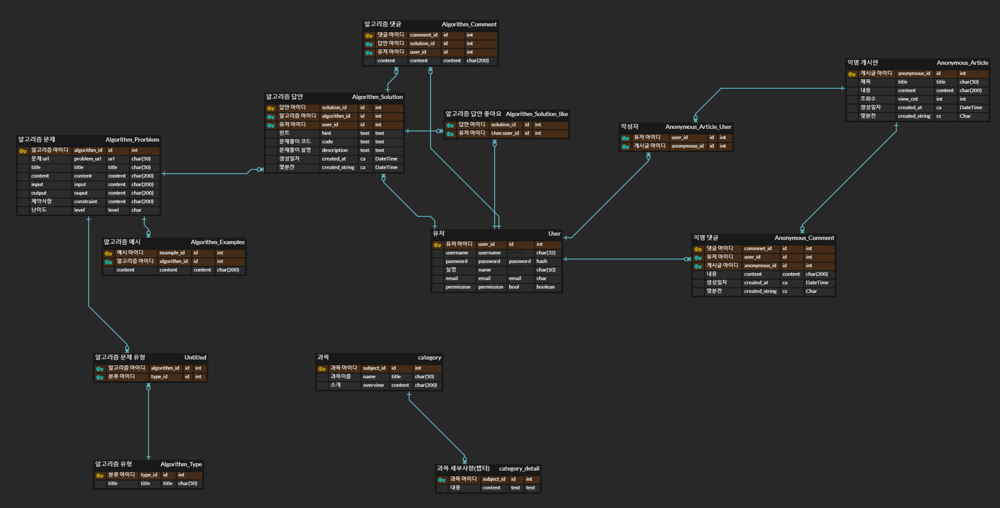
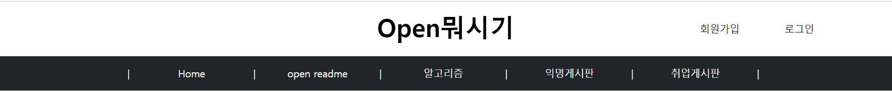
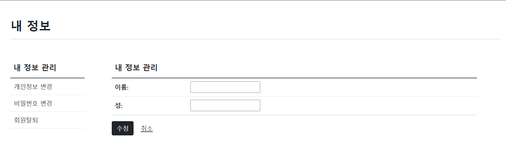
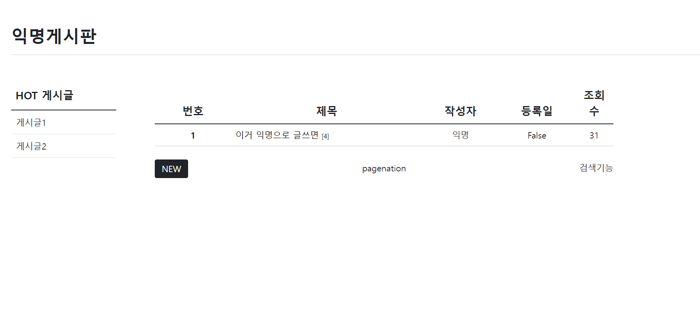

# Open Textbook


### Abstract

 SSAFY 학생들의 집단 지성을 위해서 수업 내용 필기 및 프로그래밍 공부에 관련된 정보들을 오픈소스 형식으로 제공하는 웹페이지를 제공하고자한다. 부가적으로 알고리즘 공부 및 커뮤니티 활동과 같은 기능들을 제공한다.

해당 시스템은 크게 세가지 기능을 포함한다.

1. 오픈소스 교제 
2. 백준 소스코드 공유 및 추천 시스템
3. 익명 게시판


### 0. 방향성

먼저 only 장고만을 활용해서 만들고 

Vue.js를 배운후 REST api와 Vue.js로 분리하는 방식으로 리팩터링

 

### 1. 요구사항 정의서 & 기획서

(1) 목적

* SSAFY 교육생들의 집단지성을 활용한 프로젝트 및 공부 교재 만들기
* 백준 소스코드 공유 및 추천 시스템을 활용하여 좋은 알고리즘 풀이 공유
* 익명 게시판을 통해 기존에 실명으로 잘 말하지 못하는 대화 가능


(2) 타깃

* 모든 SSAFY 7기 부울경 1반 학생들


### 2. 명세서 

(1) 준비사항

* 개발 도구 및 라이브러리

  * 개발 도구 : sss

  * 라이브러리 :

    ```bash
    asgiref==3.5.0
    Django==3.2.12
    django-appconf==1.0.5
    django-extensions==3.1.5
    django-imagekit==4.1.0
    djangorestframework==3.13.1
    pilkit==2.0
    Pillow==9.1.0
    pytz==2022.1
    six==1.16.0
    sqlparse==0.4.2
    ```

    

(2) Application

* accounts
* opentextbook
* algorithms
* anonymous_articles


(3) Models

* accounts

  * User
    * username : Char
    * password : Hash
    * 실명 : Char
    * 
  * 

* opentextbook

  * subject

    * subject_id : Int
    * 과목 이름 : Char
    * 소개 : text

  * subject_detail

    * 과목 : ForeignKey(subject)

    * 내용 : Text 

      

* algorithms

  * Algorithm_Problems

    * 유형 : ManytoMany(Algorithm_Types)

    * 추천인 : ManytoMany(User)

    * url : Char

    * 제목 : Char

    * 내용 : Text

    * input : Text

    * output : Text

    * 제약사항 : Text

    * 난이도 : Text (Choice)

      

  * Algorithm_Solution

    * User : ForeignKey(User)

    * problem : ForeignKey(Algorithm_Problems)

    * 추천인 : ManytoMany(User)

    * 힌트 : Text

    * 문제풀이 코드 : Text

    * 문제 풀이 설명 : Text

    * created_at : DateTime

    * @Property created_string

      

  * Algorithm_Comment

    * User : ForeignKey(User)

    * Solution : ForeignKey(Solution)

    * content : Char

    * created_at : DateTime

      

  * Algorithm_Examples

    * problem : ForeignKey(Algorithm_Problems)

    * content : Text

      

  * Algorithm_Types (한 문제에 여러가지 분야가 들어갈 수 있을것 같아서 ManytoMany로 했습니다!)

    * content : Char

  

* anonymous_articles

  * Anonymous_Article

    * User : ForeignKey(User)

    * 추천인 : ManytoMany(User)

    * 제목 : Char

    * 내용 : Text

    * 조회수 : Integer

    * created_at : DateTime

    * created_string : @Property 

      

  * Anonymous_Comment:

    * User : ForeignKey(User)
    
    * Article : ForeignKey(Anonymous_Article)
    
    * content : Char
    
    * created_at : DateTime
    
    * created_string : @Property 
    
      



(4) urls

* accounts

  |        url        | method |          기능          |
  | :---------------: | :----: | :--------------------: |
  |     accounts/     |  GET   | 내 정보 페이지 렌더링  |
  | accounts/signin/  |  GET   |  로그인 페이지 렌더링  |
  | accounts/signin/  |  POST  |         로그인         |
  | accounts/signup/  |  GET   | 회원가입 페이지 렌더링 |
  | accounts/signup/  |  POST  |   회원가입 후 로그인   |
  | accounts/signout/ |  POST  |        로그아웃        |
  | accounts/delete/  |  GET   |  회원탈퇴 확인 페이지  |
  | accounts/delete/  |  POST  |        회원탈퇴        |
  |                   |        |                        |


* open-textbooks

  user
  
  |                    url                    | method |                기능                |
  | :---------------------------------------: | :----: | :--------------------------------: |
  |              open-textbook/               |  GET   |  오픈 텍스트북 소개 페이지 렌더링  |
  |    open-textbook/{str: subject_name}/     |  GET   |    해당 과목 문서 페이지 렌더링    |
  | open-textbook/{str: subject_name}/update/ |  GET   | 해당 과목의 OTB 수정 페이지 렌더링 |
  | open-textbook/{str: subject_name}/update/ |  PUT   |        해당 과목의 OTB 수정        |
  |                                           |        |                                    |
  
  api
  
  |                      url                      | method |            기능            |
  | :-------------------------------------------: | :----: | :------------------------: |
  |              api/open-textbook/               |  GET   |    OTB 소개 데이터 반환    |
  |    api/open-textbook/{str: subject_name}/     |  GET   | 해당 과목 문서 데이터 반환 |
  | api/open-textbook/{str: subject_name}/update/ |  PUT   |    해당 과목의 OTB 수정    |
  |                                               |        |                            |
  
  

* algorithms

  user

  |                            url                             | method |                  기능                  |
  | :--------------------------------------------------------: | :----: | :------------------------------------: |
  |                        algorithms/                         |  GET   |      알고리즘 index 페이지 렌더링      |
  |                        algorithms/                         |  POST  |  알고리즘 문제 생성하기(누구나 가능)   |
  |                     algorithms/write/                      |  GET   |     알고리즘 CREATE 페이지 렌더링      |
  |              algorithms/{int: algorithm_pk}/               |  GET   | 문제 detail 페이지 렌더링 (+solutions) |
  |              algorithms/{int: algorithm_pk}/               |  PUT   |          알고리즘 문제 UPDATE          |
  |          algorithms/{int:algorithm_pk}/solution/           |  POST  |         알고리즘 솔루션 CREATE         |
  |          algorithms/{int:algorithm_pk}/solution/           |  GET   |   알고리즘 솔루션 생성 페이지 렌더링   |
  | algorithms/{int:algorithm_pk}/solution/{int: solution_pk}/ |  PUT   |        알고리즘 솔루션 수정하기        |
  |                                                            |        |                                        |

  api

  |                   url                   | method |           기능            |
  | :-------------------------------------: | :----: | :-----------------------: |
  |            /api/algorithms/             |  GET   |   알고리즘 리스트 반환    |
  |            /api/algorithms/             |  POST  |   알고리즘 문제 CREATE    |
  |   /api/algorithms/{int:algorithm_pk}/   |  GET   | 해당 알고리즘 디테일 반환 |
  |   /api/algorithms/{int:algorithm_pk}/   |  PUT   |   해당 알고리즘 UPDATE    |
  | algorithms/{int:algorithm_pk}/solution/ |        |                           |

  

* anonymous

  * front-end

  |                  url                  | method |               기능               |
  | :-----------------------------------: | :----: | :------------------------------: |
  |              anonymous/               |  GET   |  익명게시판 index 페이지 렌더링  |
  |              anonymous/               |  POST  |        익명게시판 글작성         |
  |     anonymous/{int:anonymous_pk}/     |  GET   | 익명 게시글 detail 페이지 렌더링 |
  |     anonymous/{int:anonymous_pk}/     |  PUT   |         익명 게시글 수정         |
  |     anonymous/{int:anonymous_pk}/     | DELETE |         익명 게시글 삭제         |
  | anonymous/{int:anonymous_pk}/comment/ |  POST  |      게시글에 Comment 작성       |
  |  anonymous/comment/{int:comment_id}   | DELETE |        해당 comment 삭제         |
  |                                       |        |                                  |

  * back-end

  |                    url                    | method |              기능              |
  | :---------------------------------------: | :----: | :----------------------------: |
  |              api/anonymous/               |  GET   | 익명게시판 article 리스트 반환 |
  |              api/anonymous/               |  POST  |      익명게시판 글 CREATE      |
  |     api/anonymous/{int:anonymous_pk}/     |  GET   |     해당 게시글 정보 반환      |
  |     api/anonymous/{int:anonymous_pk}/     |  PUT   |       익명 게시글 UPDATE       |
  |     api/anonymous/{int:anonymous_pk}/     | DELETE |       익명 게시글 DELETE       |
  | api/anonymous/{int:anonymous_pk}/comment/ |  POST  |  해당 게시글에 Comment CREATE  |
  |  api/anonymous/comment/{int:comment_id}   | DELETE |      해당 Comment DELETE       |
  |                                           |        |                                |

  

(5) templates

* 공용

  * base.html

    | 컴포넌트 | 세부          | 기능                        | URL                        |
    | -------- | ------------- | --------------------------- | -------------------------- |
    | 버튼     | 로고          | 홈페이지로 이동             | 'index/' GET               |
    | 버튼     | 로그인        | 로그인 페이지로 이동        | 'accounts/signin/' GET     |
    | 버튼     | 회원가입      | 회원가입 페이지로 이동      | 'accounts/signup/' GET     |
    | 버튼     | 내 정보       | 내 정보 페이지로 이동       | 'accounts/index/' GET      |
    | 버튼     | 로그아웃      | 로그아웃                    | 'accounts/signout/' POST   |
    | Navbar   | HOME          | 홈페이지로 이동             | 'index/' GET               |
    | Navbar   | Open Textbook | Open Textbook 페이지로 이동 | 'opentextbooks/index/' GET |
    | Navbar   | 알고리즘 코드 | 알고리즘 페이지로 이동      | 'algorithms/index/' GET    |
    | Navbar   | 익명게시판    | 익명 게시판 페이지로 이동   | 'anonymouses/index/' GET   |
    |          |               |                             |                            |
  
    
  
    
  
  * accounts_base.html
  
    base.html 에 추가
  
    | 컴포넌트    | 세부          | 기능                         | URL                    |
    | ----------- | ------------- | ---------------------------- | ---------------------- |
    | 좌측 테이블 | 내 정보       | 내 정보 페이지로 이동        | 'accounts/delete/' GET |
    | 좌측 테이블 | 개인정보 수정 | 개인정보 수정 페이지로 이동  | 'accounts/delete/' GET |
    | 좌측 테이블 | 비밀번호 수정 | 비밀번호 변경 페이지로 이동  | 'accounts/delete/' GET |
    | 좌측 테이블 | 회원탈퇴      | 회원 탈퇴 확인 페이지로 이동 | 'accounts/delete/' GET |
    
    
    

  

  * opentextbook_base.html

  * 이거 잘 모르겠슴다 
  
    
  
  * algorithm_base.html

    | 컴포넌트      | 세부           | 기능                    | URL      |
    | ------------- | -------------- | ----------------------- | -------- |
    | h1            | 타이틀         | 타이틀 표시             | 없음     |
    | 좌측 테이블1  | 유형 분류 필터 | 선택한 유형의 문제 표시 | Vue 사용 |
    | 좌측 테이블 2 | 레벨 분류 필터 | 선택한 레벨의 문제 표시 | Vue 사용 |
    |               |                |                         |          |
  
    
  
  * algorithm_index.html
  
    | 컴포넌트    | 세부     | 기능                               | URL                              |
    | ----------- | -------- | ---------------------------------- | -------------------------------- |
    | 메인 테이블 | 리스트   | 등록된 알고리즘 리스트 표시        | detail                           |
    | 메인 body   | 검색기능 | 키워드 번호로 검색된 리스트만 표시 | 'algorithms/find/{keyword}/' GET |
    |             |          |                                    |                                  |
  
  
  
  * anonymous_base.html
  
    | 컴포넌트    | 세부       | 기능                                         | URL                                 |
    | ----------- | ---------- | -------------------------------------------- | ----------------------------------- |
    | h1          | 타이틀     | 타이틀 표시                                  | 없음                                |
    | 좌측 테이블 | Hot 게시글 | 상위 추천 수 및 댓글 수를 가지는 게시글 표시 | 'anonymous/{int:anonymous_pk}/' GET |
    |             |            |                                              |                                     |
  
    
  
  * asdasdasdsadsad
  
  * saddasd

(5) 목업


### 3. 결정해야하는 것

전체적인 레이아웃

* accounts
  * 레벨 만드실건가유?
* opentextbook
  * 레이아웃과 어떤 방식으로 보여줄 것인지
* 알고리즘
  * 문제 정보들을 다 들고 올것인지? 결정해야함
* 익명 게시판
  * 그냥 자유게시판에 익명가능? or 익게 자게 따로


### 4. 공부해야 하는 것

* accounts 
  * 만약 하민님 이야기 처럼 level 넣으면 어떻게 할지?
* opentextbook
  * content에 Markdown문법 적용하는 방법
  * 허가된 사용자만 편집기능 사용할 수 있게 하는 것
* 알고리즘
  * 코드 색깔 변하게 해주는거!
  * 마크다운 
* 익명게시판
  * 익명뒤에 숫자로 사람 특정하는 방법

